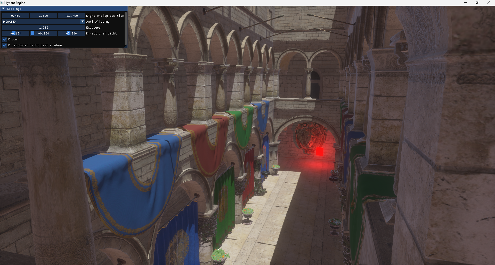
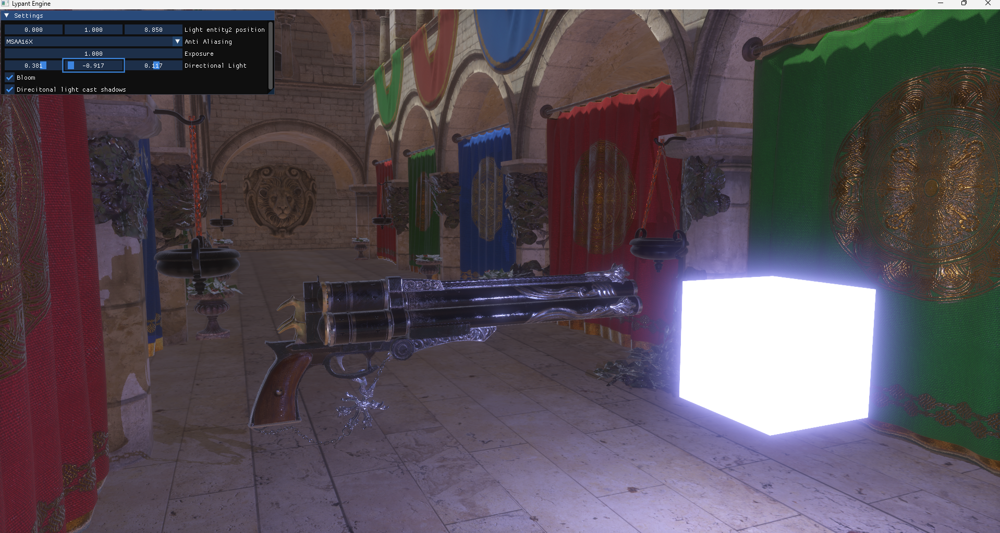
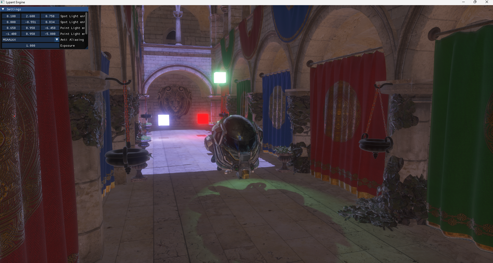
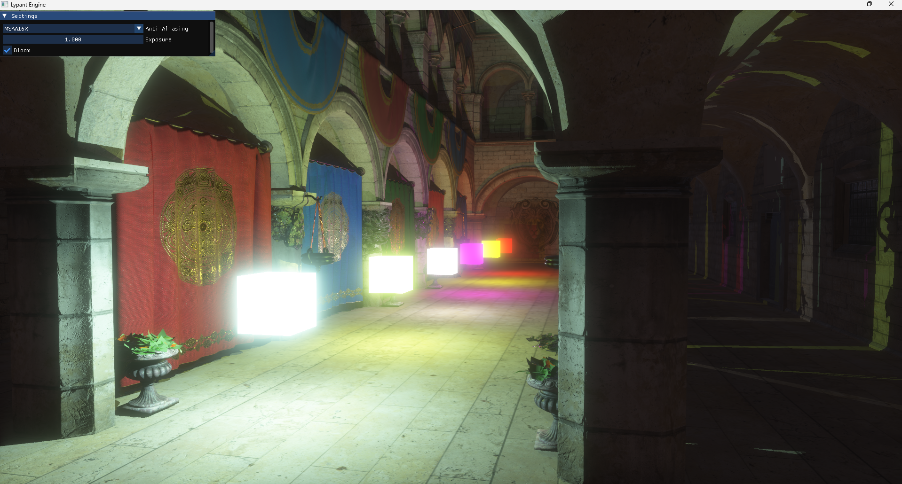

# Lypant Engine

A modern, real-time rendering engine written in C++ and powered by OpenGL, designed with physically-based rendering (PBR), high dynamic range (HDR), and advanced lighting and shadow techniques in mind.

---

## ✨ Features

- 🛠 **Physically Based Rendering (PBR)**
  - Full PBR material pipeline with Image-Based Lighting (IBL)
  - GGX specular prefiltering, irradiance convolution, BRDF LUT
- 🌅 **HDR & Bloom**
  - High Dynamic Range rendering pipeline
  - Physically correct bloom
- 🌈 **Advanced Lighting**
  - Directional lights with Cascaded Shadow Maps (CSM)
  - Omnidirectional shadow mapping for point lights
  - Directional shadow mapping for spot lights
- 🎞 **Anti-Aliasing Options**
  - MSAA2X, MSAA4X, MSAA8X, MSAA16X (Multisample Anti-Aliasing)
- 🧠 **Entity Component System (ECS)**
  - Modern ECS-based architecture
  - Custom component scripting support
- ⚙️ **Editor GUI**
  - Built-in ImGui interface for real-time tweaking of engine parameters
  - Dynamic scene control and live updates

---

## 🖼 Screenshots






---

## 🛠 Building the Engine (Windows)

1. Clone the repository (recursive to pull submodules):
   ```bash
   git clone --recursive https://github.com/BarisPozlu/Lypant-Engine
   ```

2. Run the setup script to build dependencies:
   ```
   build/windows/SetupLibraries.bat
   ```

3. Generate the Visual Studio solution:
   ```
   build/windows/GenerateSolution.bat
   ```

4. Open the generated solution file and build with Visual Studio.

---

## 🐧 Building on Other Platforms

Even though a `premake` binary is not provided for non-Windows platforms, the build process is still similar:

1. Clone the repository with submodules.
2. Run the `SetupLibraries` script manually.
3. Run `premake5` yourself to generate platform-specific project files:
   ```bash
   premake5 gmake2    # for Linux Makefiles
   premake5 xcode4    # for macOS
   ```

> Make sure you have [Premake5] installed globally or locally.

---
